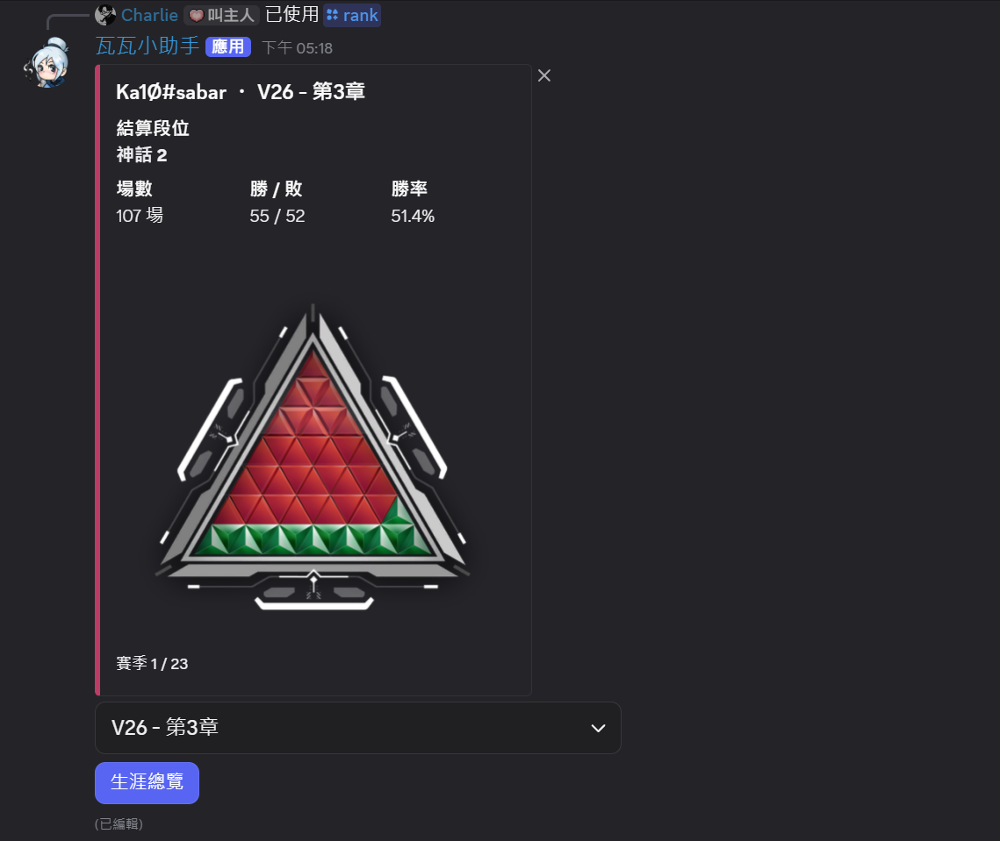
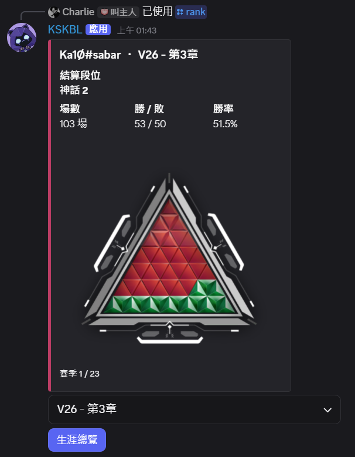
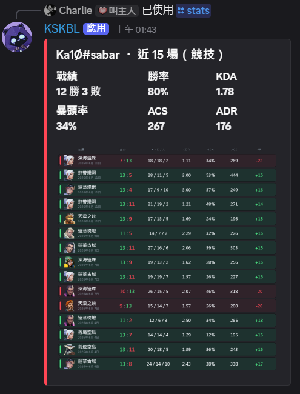
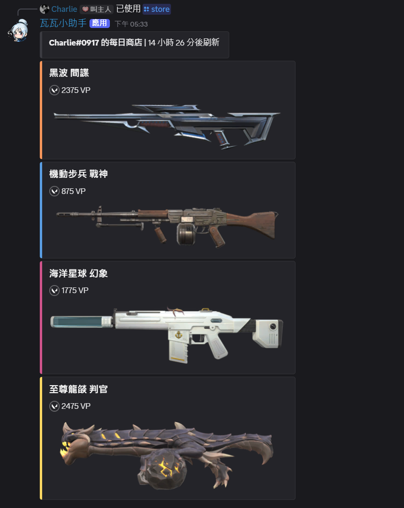

# 瓦瓦小助手

Valorant Discord Bot，支援查詢段位、近期戰績與每日商店。

## 預覽






## 指令

| 指令 | 說明 |
|------|------|
| `/ping` | 確認 Bot 是否在線 |
| `/bind` | 綁定 Riot ID，之後查詢可以不用每次輸入 |
| `/unbind` | 解除綁定 |
| `/setregion` | 設定伺服器預設查詢區域（需管理員）|
| `/rank` | 查詢段位、歷史最高、各賽季紀錄 |
| `/stats` | 近 15 場競技統計（KDA / 暴頭率 / ACS / RR）|
| `/store` | 查詢今日個人商店 |
| `/login` | 用 Riot Cookie 登入商店 |
| `/logout` | 登出並清除登入資料 |
| `/tutorial` | 取得商店登入教學（傳送私訊）|

## 環境變數

```env
DISCORD_TOKEN=
HENRIK_API_KEY=
GUILD_ID=          # 開發用，上線留空
ENCRYPTION_KEY=    # 用 python scripts/gen_key.py 產生
VP_EMOJI_ID=       # 用 python scripts/setup_emojis.py 上傳後取得
```

## 安裝

```bash
python -m venv .venv
source .venv/bin/activate   # Windows: .venv\Scripts\activate
pip install -r requirements.txt
cp .env.example .env
python bot.py
```

## 專案結構

```
valorant-bot/
├── bot.py
├── cogs/
│   ├── binding.py
│   ├── rank.py
│   ├── region.py
│   ├── stats.py
│   └── store.py
├── services/
│   ├── henrik_api.py
│   ├── riot_auth.py
│   └── riot_store.py
├── utils/
│   ├── assets.py
│   ├── constants.py
│   ├── crypto.py
│   ├── database.py
│   ├── pyramid.py
│   ├── rank_ui.py
│   ├── settings.py
│   ├── stats_card.py
│   ├── stats_ui.py
│   └── store_ui.py
└── assets/
    └── tutorial/
```

## 致謝

- [Henrik Dev API](https://docs.henrikdev.xyz/) — 段位與對戰資料來源
- [Valorant-API.com](https://valorant-api.com/) — 皮膚名稱、圖片與賽季素材

## 備註

- 商店登入使用 Riot ssid cookie，約一個月過期
- cookie 加密後才寫入 `data/bot.db`，金鑰儲存在 `.env`
- 素材快取在 `.asset_cache/`，`data/` 皆已加入 `.gitignore`
